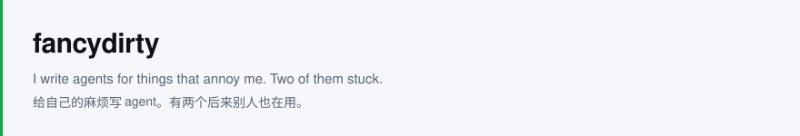
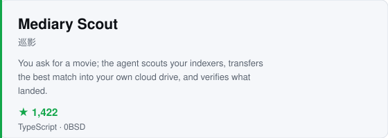
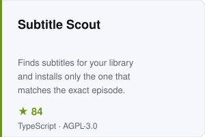

<picture>
  <source media="(prefers-color-scheme: dark)" srcset="assets/banner-dark.svg">
  
</picture>

<a href="https://github.com/fancydirty/mediary-scout">
  <picture>
    <source media="(prefers-color-scheme: dark)" srcset="assets/card-mediary-dark.svg">
    
  </picture>
</a>
<a href="https://github.com/fancydirty/subtitle-scout">
  <picture>
    <source media="(prefers-color-scheme: dark)" srcset="assets/card-subtitle-dark.svg">
    
  </picture>
</a>

Right now I'm working out how an agent verifies its own work instead of
reporting success, and how one codebase ships as both a desktop app and a
Docker service without forking into two.

Next: an Android comic library that survives both takedowns and new phones.
Local-first, bring-your-own-source, client-encrypted migration. Kotlin +
Compose. Not public yet.

[mediaryscout.app](https://mediaryscout.app) · [subtitlescout.com](https://subtitlescout.com)
